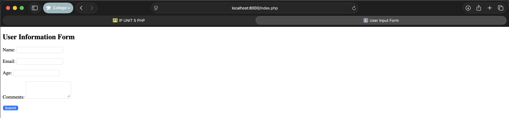
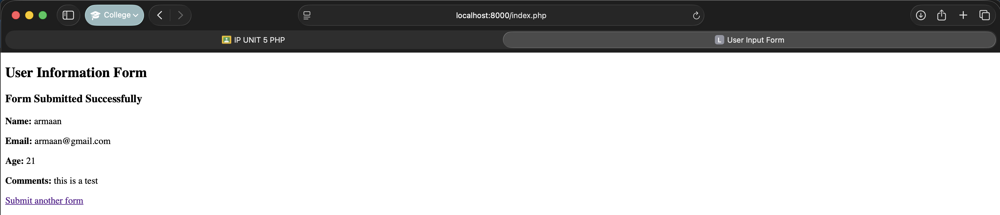

# Q4 - PHP User Information Form

## Overview
This folder contains a PHP-based user information form that demonstrates form handling, input validation, and data processing with PHP.

## Files
- `index.php` - Contains the PHP script that renders and processes the user information form
- `user_form.png` - Screenshot of the empty form before submission
- `user_form_submitted.png` - Screenshot of the form after successful submission

## Features
- Form validation for required fields
- Email format validation using PHP's filter_var function
- Age validation to ensure a numeric value
- Sanitization of user inputs to prevent XSS attacks
- Error messages for invalid inputs
- Display of submitted data after successful form submission

## Usage
To use this form:
1. Place the files in a PHP-enabled web server
2. Navigate to the `index.php` file in a web browser
3. Fill out the form with your information
4. Submit the form to see the validation in action
5. Upon successful submission, your information will be displayed

## Implementation Details
The form collects the following information:
- Name (required)
- Email (required, must be valid format)
- Age (required, must be numeric)
- Comments (optional)

The PHP script uses the `$_POST` superglobal to collect form data and implements both client-side and server-side validation.

## Output:

