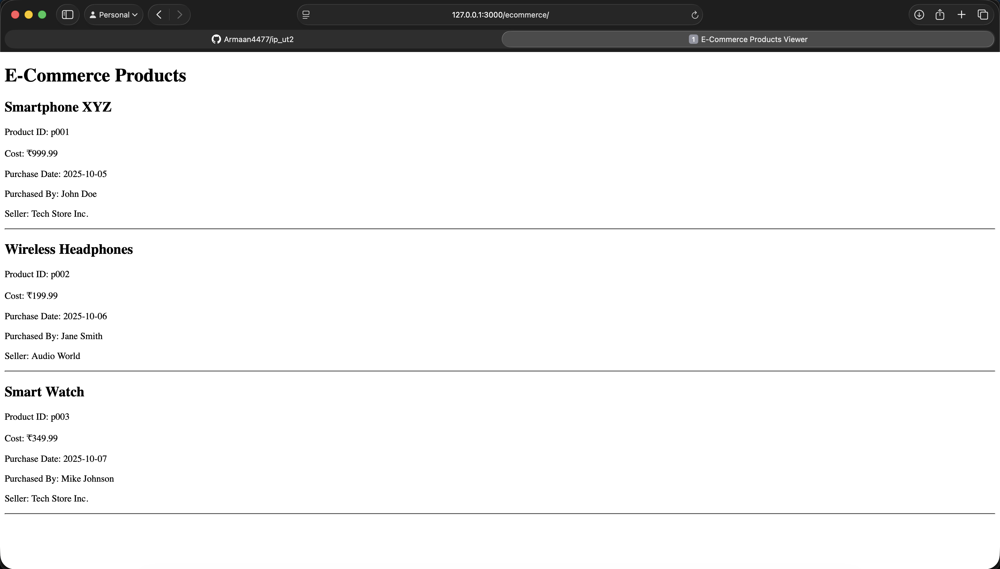

## Q3 IP, UT2.
Basic code for an e-commerce webpage that displays product details from an XML file using JavaScript and HTML.

## Code files:
1. index.html - The main HTML file that structures the webpage and includes JavaScript to fetch and display product data.
2. products.xml - An XML file containing product details such as product ID, name, cost, purchase date, purchaser, and seller.
3. products.dtd - A DTD file defining the structure and rules for the products.xml file.

## Output:

